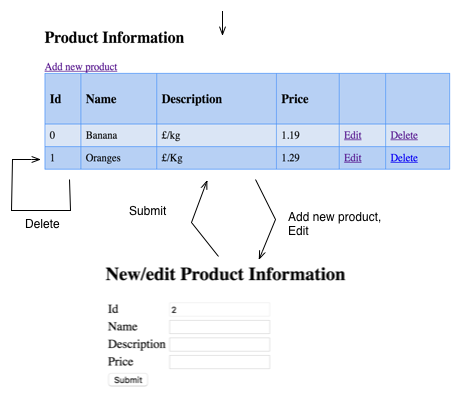

<link rel='stylesheet' href='web/swiss.css'/>

# Spring MVC: exercise 04 - master/detail

Import the project `sprint2/SpringMvc_ex04` from your local GitHub repository into your STS workspace using `Import>Existing Gradle Project`.

In this exercise, the goal is to develop a master/detail GUI (Graphical User Interface) to support CRUD (Create/Read/Update/Delete) operations of product information in a store. 

## Skeleton of the web application

By the end of these exercises, the presentation layer should implement the following navigational model (where each screenshot represents a web page and transitions correspond to HTTP requests represented by buttons or hyperlinks in a web page):

The architecture of the boilerplate code available in the repository is as follows:

		/src
		|-- main
	        |-- java
	            |-- labJstl
	                |-- LabJstlApplication.java: 
	                |-- WebConfig.java
	                |-- controller
	                    |-- IndexController.java
	                |-- domain
	                    |-- SimpleProduct.java
	        |-- resources
	            |-- application.properties
		    |-- webapp
		        |-- WEB-INF
		            |-- views: where the JSP files can be found
		                |-- forms
		                	|-- master.jsp
		                    |-- detail.jsp

### Exercise: master/detail with JSPs and plain HTML.

Add the following methods to the class `IndexController.java`:
* `public String productDetail(@ModelAttribute("product") SimpleProduct product, @RequestParam(value="productId", required=false, defaultValue="-1") int productId)`
  * add the corresponding `@RequestMapping` for declaring a `GET "/productDetail"` request
  * if `productId > 0` (that is, it is a modification), the method sets the properties of the variable `product` with the product with identifier `productId` in `productList`  
  * else, the identifier of `product` is set to `SimpleProduct.lastIdSimpleProduct.lastId`
* `public String addProduct(@ModelAttribute("product") SimpleProduct product, Model model)`
  * add the `@RequestMapping` for a `POST "/addProduct"` request when the `Submit` button is clicked 
  * the product with id `productId` is removed from `productList`
  * a new product with information in the form is added to `productList`
  * the master view must display the resulting list of products
* `public String deleteProduct(@RequestParam(value="productId", required=false, defaultValue="-1") int productId, Model model)`
  * add the `@RequestMapping` for a `GET "/deleteProduct"` request
  * the product with id `productId` is removed from `productList`
  * the master view must display the remaining list of products
  
 
***
&copy; Artur Boronat, 2016-17