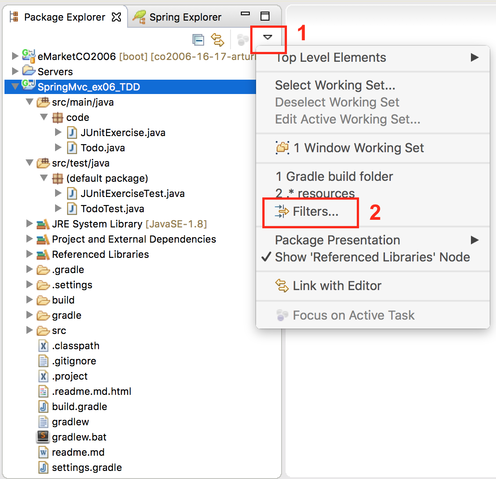
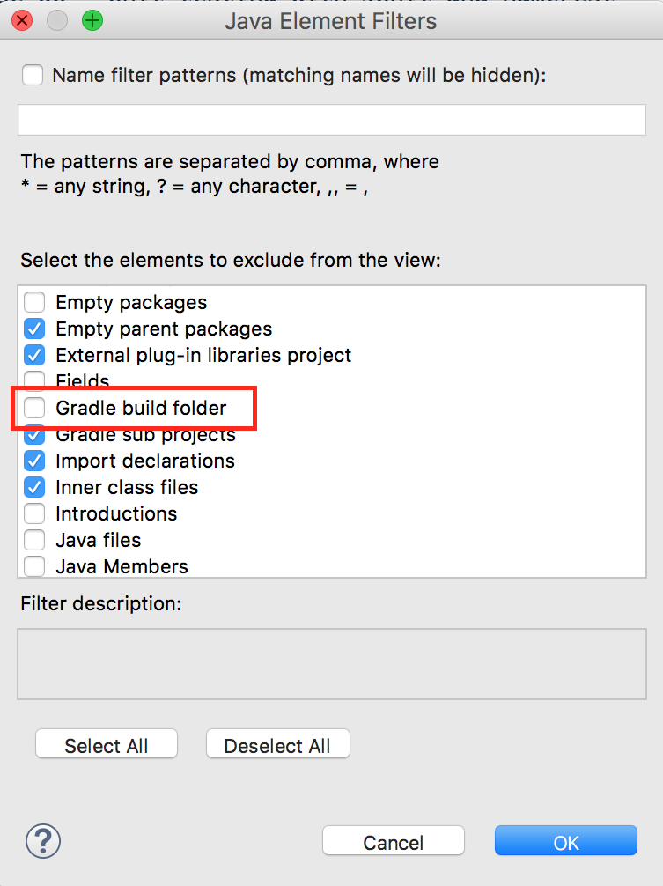

<link rel='stylesheet' href='web/swiss.css'/>

# Spring MVC: exercise 06 - Unit testing with JUnit and Hamcrest

The following exercises need to be solved in the files under the folder `src/test/java`, in the package `code`.

To run your JUnit cases, there are different options:
* From the STS IDE: 
  * right click on source code folder `src/test/java` or on a specific test java file 
  * `Run As` > `JUnit test`
  * You will see the result in the JUnit view 
* From Gradle (terminal) 
  * run `./gradlew test`
  * this will generate a report under `build/reports/tests/index.html`, which can be accessed 
    * If you can't see the folder `build`, go to section [Troubleshooting](#troubleshooting) of this worksheet.
    * From the STS IDE: right click on file `index.html` > `Open with...` > `Web browser`
    * From your system: use a browser and access `file:///<absolute path>/build/reports/tests/index.html`

## :star: Exercise 1

Ensure via JUnit tests with Hamcrest matchers that `list` from `code.JUnitExercise.java`:
  1. has a size of `3`
  2. contains the elements `2, 4, 5` in any order
  3. every item is greater than `1`

## :star: Exercise 2

Ensure via JUnit tests with Hamcrest matchers that the `ints` array from `code.JUnitExercise.java`:
  1. has a size of `4`
  2. contains `7, 5, 12, 16` in the given order

## :star: Exercise 3

Write JUnit tests that, using Hamcrest matchers, ensure that:
  1. `""` is an empty string
  2. a given string (e.g. `""`), check that it is either empty or null

## :star::star: Exercise 4

Given the class `code.Todo.java`, write tests that use Hamcrest matchers (for beans) that ensure that:
  1. A `Todo` object has a property called `"task"`
  2. If a `Todo` object is constructed with the task `"Learn Hamcrest"` that the task property has the correct value
  3. Two objects created with the same values, have the same property values

## :star: Exercise 5
Given the class `code.Todo.java`, write tests that use Hamcrest matchers (for beans) that ensure that:
  * the method `Todo::setYear(int)` throws an exception of type `Exception.class` when we use a year that has already passed (e.g. `2006`) 

## Troubleshooting

### I can't see the `build` folder

You may not be able to see the `build` folder in `Package explorer` of the Java perspective of your STS if it is being filtered

To show it, in the `Package explorer` of the Java perspective, click on `1` and `2` as shown in the picture:

    
Deselect `Gradle build folder` if it is currently excluded from the view:

## Additional resources
* [Hamcrest (homepage)](http://hamcrest.org)
* [Hamcrest quick reference](http://www.marcphilipp.de/downloads/posts/2013-01-02-hamcrest-quick-reference/Hamcrest-1.3.pdf)
* [Hamcrest examples](http://www.leveluplunch.com/java/examples/#java-hamcrest)
* [Using Hamcrest for testing - Tutorial](http://www.vogella.com/tutorials/Hamcrest/article.html) (Vogella)
* [Three ways to test exceptions](http://www.mkyong.com/unittest/junit-4-tutorial-2-expected-exception-test/) (Mkyong.com)