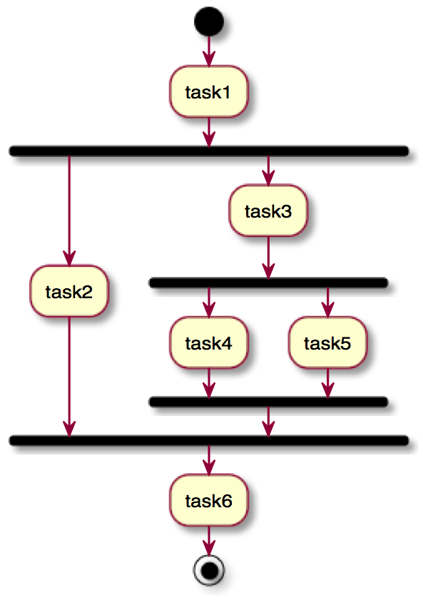

<link rel='stylesheet' href='web/swiss.css'/>

# CO2006 - Gradle: exercise 1

## Tutorial 

### Getting started

* Once you have cloned the repository, import the project Gradle_ex01 using the Gradle import facility in your IDE (the order of steps may vary depending on the OS that you are using):
  - `File > Import...`
  - `Existing Gradle Project`
  - Select the project `Gradle_ex01` in your local GitHub repository, and click `Next`.
  - Select `Override workspace settings` and select `Gradle wrapper`. Click `Next`.
  - No errors should be shown in the message box. Click `Finish`.
* Solve the exercises in the file `build.gradle`.

### Exercise A (:star:)

Write a task that prints `Hello World!` on the output console.

### Exercise B (:star:)

* Write 6 tasks, each of them should print `I'm task number n`, where `n` is to be replaced by the number of the task. For example `./gradlew -q task1` should print out `I'm task number 1`.
* Define the dependencies that correspond to the following activity diagram, where directed edges correspond to the `finalizedBy` clause.

The output of using the command `./gradlew -q task6` should be something similar to:

	I'm task number 1
	I'm task number 2
	I'm task number 3
	I'm task number 4
	I'm task number 5
	I'm task number 6

Note that this is not the only ordering of tasks that is feasible. For example, it would entirely correct to execute `task5` before `task4`.

### Exercise C (:star::star:)

* Create a gradle task that copies files from folder `src/main/resources/source/` to `src/main/resources/target/`.
* Copy only those files whose name corresponds to an even number.
* *Hint*: explore [the documentation of the Copy task](https://docs.gradle.org/current/dsl/org.gradle.api.tasks.Copy.html) and use your Java/Groovy skills to achieve what you are asked to do

## Additional Resources

* [Getting started](https://docs.gradle.org/current/userguide/tutorials.html): official Gradle tutorial to get started with Gradle.
* [Gradle's user guide](https://docs.gradle.org/current/userguide/userguide)
* [Gradle DSL reference](https://docs.gradle.org/current/dsl)
* [Gradle tutorial - Tutorialspoint](http://www.tutorialspoint.com/gradle/)

***
&copy; Artur Boronat, 2015-17 

