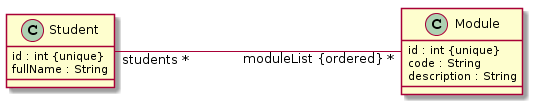
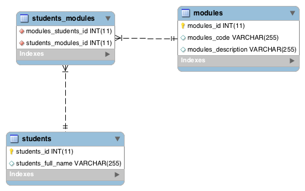

<link rel='stylesheet' href='web/swiss.css'/>

# Exercise 03. Java Persistence API (JPA)

Table of contents:
* [Configuration](#configuration)
* [Examples](#examples-using-jpa)
* [Exercise](#star-star-exercise)
* [Additional resources on JPA](#additional-resources-on-jpa)

## Configuration

### Database access 

The following Java class contains all the information that is required to connect to a MySQL server:

`src/main/java/jpa/DbConfig.java`

	@Configuration
	public class DbConfig {
	  @Bean
	  public DriverManagerDataSource dataSource() {		
	    DriverManagerDataSource ds = new DriverManagerDataSource();
	    ds.setDriverClassName("com.mysql.jdbc.Driver");
	    // jdbc:mysql://host:port/db
	    ds.setUrl("jdbc:mysql://HOST:PORT/DB");
	    ds.setUsername("USERNAME");
	    ds.setPassword("PASSWORD");
	    return ds;
	  }
	}
	
Replace the following parameters as follows depending on whether you are running your code from campus (e.g. from a lab machine) or off campus (e.g. from home or from eduroam):

##### From campus

Replace the following variables in the class `DbConfig.java` as follows:

* `HOST` with `mysql.mcscw3.le.ac.uk` 
* `PORT` with `3306`
* `USERNAME` with your user name
* `PASSWORD` with your **MySQL password**, stored in `.my.cnf` file (open a terminal console and run the command `cat .my.cnf` to view it).

##### Off-campus

From a terminal console: run the command 

	ssh -fNg -L 3307:mysql.mcscw3.le.ac.uk:3306 ${USERNAME}@xanthus.mcscw3.le.ac.uk
	
where `${USERNAME}` has to be replaced with your actual user name. This command creates a [SSH tunnel](https://en.wikipedia.org/wiki/Tunneling_protocol) from a port (`3307` in our command) on the local machine to the MySQL server port (`3306` in our command) on the MySQL host machine. The server `xanthus.mcscw3.le.ac.uk` is used as a gateway machine to reach the database server `mysql.mcscw3.le.ac.uk`. The command will ask for your Linux password. If the tunnel is created successfully, you should be able to use your terminal console as usual and **no success message is going to be shown**. This configuration is documented in more detail [here](https://campus.cs.le.ac.uk/labsupport/usinglinux/mysqlaccountdetails). If you are using Windows 10, you may want to [install Bash terminal](https://github.com/uol-inf/CO2006-17-18/blob/master/tooling.md#for-users-of-ms-windows-10). 

Replace the following variables in the `DbConfig.java` as follows:

* `HOST` with `127.0.0.1` 
* `PORT` with `3307`
* `USERNAME` and `PASSWORD` as above.

#### Hibernate configuration

In the `application.properties` file, write the following code:

`src/main/resources/application.properties`

	# server port
	server.port=8090
	# Hibernate
	spring.jpa.hibernate.ddl-auto=create
	spring.jpa.hibernate.naming_strategy: org.hibernate.cfg.ImprovedNamingStrategy

The hibernate configuration is as follows:
* `spring.jpa.hibernate.ddl-auto` indicates whether the schema is generated automatically or not. Some of the options that are available are:
  * `none`: the schema is not generated. This option allows you to reuse a previous database that is already populated with data.
  * `create`: the schema is generated. When you run your application the second time, Spring will try to delete the schema before regenerating it from scratch. This option allows you to generate a schema from scratch form your Java code.
  * `create-drop`: the schema is transient. That is, it will be created from scratch for your application instance and, once the execution is over, it is destroyed. This option is helpful to test your application once you have a proper test suite up and running. However, once the execution is over you will not be able to see what happened by inspecting the database with external tools such as [MySQLWorkbench](https://www.mysql.com/products/workbench/). 
* `spring.jpa.hibernate.naming_strategy`: strategy used to create names for elements in the database schema.
 

## Examples using JPA

### a. Class

This example is adapted from [Exercise 02.a](../sprint4.ex02#star-a-tables).

From [Ex1_Department.java](src/main/java/jpa/a/Ex1_Department.java), 

	@Entity(name="Ex1_Department")
	public class Ex1_Department {
	  @Id
	  @GeneratedValue(strategy=GenerationType.TABLE)
	  @Column(name="dept_code", nullable=false)
	  private String dept_code;
	  @Column(name="dept_name", nullable=false)
	  private String dept_name;
	}

Hibernate generates: 

	CREATE TABLE `ex1_department` (
	  `dept_code` varchar(255) NOT NULL,
	  `dept_name` varchar(255) NOT NULL,
	  PRIMARY KEY (`dept_code`)
	)

### b. One-to-one relation

This example is adapted from [Exercise 02.b](../sprint4.ex02#starstar-b-one-to-one-relation).

From [the classes in package b](src/main/java/jpa/b/), 

	@Entity(name="Ex2_Department")
	public class Ex2_Department {
	  @Id
	  @GeneratedValue(strategy=GenerationType.TABLE)
	  private String dept_code;
	  @Column(name="dept_name", nullable=false)
	  private String dept_name;
	  @OneToOne(optional=false)
	  @JoinColumn(name="dept_hod")
	  private Ex2_Employee dept_hod;
	}
	
	@Entity(name="Ex2_Employee")
	public class Ex2_Employee {
	  @Id
	  @GeneratedValue(strategy=GenerationType.TABLE)
	  @Column(name="employee_id", nullable=false)
	  private int employee_id;
	  @Column(name="employee_name", nullable=false)
	  private String employee_name;
	  @Column(name="job_title")
	  private String job_title;
	}

Hibernate generates: 

	CREATE TABLE `ex2_department` (
	  `dept_code` varchar(255) NOT NULL,
	  `dept_name` varchar(255) NOT NULL,
	  `dept_hod` int(11) NOT NULL,
	  PRIMARY KEY (`dept_code`),
	  UNIQUE KEY `UK_71d5sfqnr6cn1o073vtc9kod8` (`dept_hod`),
	  CONSTRAINT `FKlenkowmjmf08eacg9o9cx25ht` FOREIGN KEY (`dept_hod`) REFERENCES `ex2_employee` (`employee_id`)
	) 
	
	CREATE TABLE `ex2_employee` (
	  `employee_id` int(11) NOT NULL,
	  `employee_name` varchar(255) NOT NULL,
	  `employee_title` varchar(255) DEFAULT NULL,
	  PRIMARY KEY (`employee_id`)
	) 

### c. One-to-many relation

This example is adapted from [Exercise 02.c](../sprint4.ex02#starstar-c-one-to-many-relation).

From [the classes in package c](src/main/java/jpa/c/), 

	@Entity(name="Ex3_Department")
	public class Ex3_Department {
	  @Id
	  @GeneratedValue(strategy=GenerationType.TABLE)
	  @Column(name="dept_code", nullable=false)
	  private String dept_code;
	  @Column(name="dept_name", nullable=false)
	  private String dept_name;
	  @OneToMany(fetch=FetchType.LAZY, cascade=CascadeType.ALL, orphanRemoval=true)
	  @JoinColumn(name="module_dept", referencedColumnName="dept_code")
	  private List<Ex3_Module> moduleList = new ArrayList<>();	
	}
	
	@Entity(name="Ex3_Module")
	public class Ex3_Module {
	  @Id
	  @GeneratedValue(strategy=GenerationType.TABLE)
	  @Column(name="module_code", nullable=false)
	  private String module_code;
	  @Column(name="module_title", nullable=false)
	  private String module_title;
	  @Column(name="module_credits", nullable=false)
	  private int module_credits;	
	}

Hibernate generates: 

	CREATE TABLE `ex3_department` (
	  `dept_code` varchar(255) NOT NULL,
	  `dept_name` varchar(255) NOT NULL,
	  PRIMARY KEY (`dept_code`)
	)
	
	CREATE TABLE `ex3_module` (
	  `module_code` varchar(255) NOT NULL,
	  `module_credits` int(11) NOT NULL,
	  `module_title` varchar(255) NOT NULL,
	  `module2dept` varchar(255) DEFAULT NULL,
	  PRIMARY KEY (`module_code`),
	  KEY `FK50qhb0a342bf82en76l8xcmeu` (`module_dept`),
	  CONSTRAINT `FK50qhb0a342bf82en76l8xcmeu` FOREIGN KEY (`module2dept`) REFERENCES `ex3_department` (`dept_code`)
	)

### d. Many-to-many relation (no attributes)

This example is adapted from [Exercise 02.d](../sprint4.ex02#starstar-d-many-to-many-relation-no-attributes).

	@Entity(name="Ex4_Department")
	public class Ex4_Department {
	  @Id
	  @GeneratedValue(strategy=GenerationType.TABLE)
	  @Column(name="dept_code", nullable=false)
	  private String dept_code;
	  @Column(name="dept_name", nullable=false)
	  private String dept_name;
	  @ManyToMany 
	  @JoinTable(name="Ex4_DepartmentEmployee",
	    joinColumns=@JoinColumn(name="department", referencedColumnName="dept_code"),
	    inverseJoinColumns=@JoinColumn(name="employee", referencedColumnName="employee_id"))	
	    private List<Ex4_Employee> employeeList = new ArrayList<>(); 
	}
	
	@Entity(name="Ex4_Employee")
	public class Ex4_Employee {
	  @Id
	  @GeneratedValue(strategy=GenerationType.TABLE)
	  @Column(name="employee_id", nullable=false)
	  private int employee_id;
	  @Column(name="employee_name", nullable=false)
	  private String employee_name;
	  @Column(name="job_title")
	  private String job_title;
	  @ManyToMany(mappedBy="employeeList")
	  private List<Ex4_Department> departmentList = new ArrayList<>();
	}

From [the classes in package d](src/main/java/jpa/d/), Hibernate generates: 

	CREATE TABLE `ex4_department` (
	  `dept_code` varchar(255) NOT NULL,
	  `dept_name` varchar(255) NOT NULL,
	  PRIMARY KEY (`dept_code`)
	) 
	
	CREATE TABLE `ex4_department_exployee` (
	  `department` varchar(255) NOT NULL,
	  `employee` int(11) NOT NULL,
	  KEY `FKc9v0dewrj88jbtfo6rvrv7u43` (`employee`),
	  KEY `FKchs2gmoi84i30k8hm4p79pfw6` (`department`),
	  CONSTRAINT `FKchs2gmoi84i30k8hm4p79pfw6` FOREIGN KEY (`department`) REFERENCES `ex4_department` (`dept_code`),
	  CONSTRAINT `FKc9v0dewrj88jbtfo6rvrv7u43` FOREIGN KEY (`employee`) REFERENCES `ex4_employee` (`employee_id`)
	)
	 
	CREATE TABLE `ex4_employee` (
	  `employee_id` int(11) NOT NULL,
	  `employee_name` varchar(255) NOT NULL,
	  `employee_title` varchar(255) DEFAULT NULL,
	  PRIMARY KEY (`employee_id`)
	) 

### e. Many-to-many relation (with attributes)

This example is adapted from [Exercise 02.e](../sprint4.ex02#starstar-e-many-to-many-relation-with-attributes).

	@Entity(name="Ex4b_Department")
	public class Ex4_Department {
	  @Id
	  @GeneratedValue(strategy=GenerationType.TABLE)
	  @Column(name="dept_code", nullable=false)
	  private String dept_code;
	  @Column(name="dept_name", nullable=false)
	  private String dept_name;
	}
	
	@Entity(name="Ex4b_Employee")
	public class Ex4_Employee {
	  @Id
	  @GeneratedValue(strategy=GenerationType.TABLE)
	  @Column(name="employee_id", nullable=false)
	  private int employee_id;
	  @Column(name="employee_name", nullable=false)
	  private String employee_name;
	  @Column(name="job_title")
	  private String job_title;
	}
	
	@Entity(name="Ex4b_DepartmentEmployee")
	public class Ex4_DepartmentEmployee implements Serializable {
	  private static final long serialVersionUID = 1L;
	  @Id
	  @ManyToOne
	  @JoinColumn(name="dept_code")
	  private Ex4_Department department; 
	  @Id
	  @ManyToOne
	  @JoinColumn(name="employee_id")
	  private Ex4_Employee employee; 
	  @Column(name="role", nullable=false)
	  private String role;
	}
	
From [the classes in package e](src/main/java/jpa/e/), Hibernate generates: 

	CREATE TABLE `ex4b_department` (
	  `dept_code` varchar(255) NOT NULL,
	  `dept_name` varchar(255) NOT NULL,
	  PRIMARY KEY (`dept_code`)
	) 
	
	CREATE TABLE `ex4b_department_employee` (
	  `role` varchar(255) NOT NULL,
	  `employee_employee_id` int(11) NOT NULL,
	  `department_dept_code` varchar(255) NOT NULL,
	  PRIMARY KEY (`employee_employee_id`,`department_dept_code`),
	  KEY `FK1pqdbwprosg9nj4gbk20w6qux` (`department_dept_code`),
	  CONSTRAINT `FK1pqdbwprosg9nj4gbk20w6qux` FOREIGN KEY (`department_dept_code`) REFERENCES `ex4b_department` (`dept_code`),
	  CONSTRAINT `FKkuauyf2r05xfdlvrxy06sljax` FOREIGN KEY (`employee_employee_id`) REFERENCES `ex4b_employee` (`employee_id`)
	) 
	
	CREATE TABLE `ex4b_employee` (
	  `employee_id` int(11) NOT NULL,
	  `employee_name` varchar(255) NOT NULL,
	  `job_title` varchar(255) DEFAULT NULL,
	  PRIMARY KEY (`employee_id`)
	) 

## :star::star: Exercise

Given the following domain classes, already implemented in package `springData.domain`: 

The exercise consists in annotating the Java classes in the package `jpa.exercise` in order to generate the following schema in the database:

whose SQL DDL script is as follows:

	CREATE TABLE `modules` (
	  `modules_id` int(11) NOT NULL,
	  `modules_code` varchar(255) DEFAULT NULL,
	  `modules_description` varchar(255) DEFAULT NULL,
	  PRIMARY KEY (`modules_id`)
	);
	CREATE TABLE `students` (
	  `students_id` int(11) NOT NULL,
	  `students_full_name` varchar(255) DEFAULT NULL,
	  PRIMARY KEY (`students_id`)
	);
	CREATE TABLE `students_modules` (
	  `modules_students_id` int(11) NOT NULL,
	  `students_modules_id` int(11) NOT NULL,
	  KEY `FK3ah1sd78bn4ebo9iv580nhelq` (`students_modules_id`),
	  KEY `FKfgffxpiei0e99weuuefvhfcqo` (`modules_students_id`),
	  CONSTRAINT `FKfgffxpiei0e99weuuefvhfcqo` FOREIGN KEY (`modules_students_id`) 
	  	REFERENCES `students` (`students_id`),
	  CONSTRAINT `FK3ah1sd78bn4ebo9iv580nhelq` FOREIGN KEY (`students_modules_id`) 
	  	REFERENCES `modules` (`modules_id`)
	);

	    
Take into account the following:	    
* Names of tables, columns and foreign keys must match those that appear in the schema.
* All database operations performed on a student must be cascaded to linked modules. 

## Additional resources on JPA

* [Tutorial JPA 1: mapping classes](https://www.javaworld.com/article/2077817/java-se/understanding-jpa-part-1-the-object-oriented-paradigm-of-data-persistence.html?page=1)
* [Tutorial JPA 2: mapping associations](https://www.javaworld.com/article/2077819/java-se/understanding-jpa-part-2-relationships-the-jpa-way.html?page=1)
* [Oracle tutorial on Java Persistence API](http://www.oracle.com/technetwork/articles/javaee/jpa-137156.html) (comprehensive)

***
&copy; Artur Boronat, 2017-18 
	    
